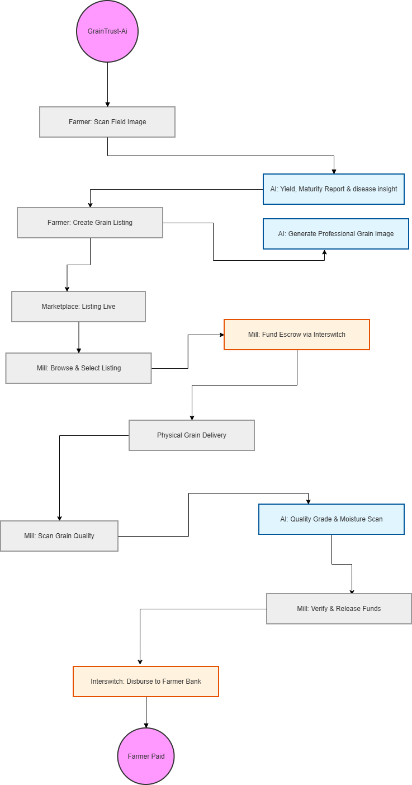

# 🌾 GrainTrust AI: Securing the Rice Supply Chain

**GrainTrust AI** is a full-stack Agri-FinTech platform designed to bridge the trust gap between smallholder farmers and grain mills in Nigeria. By combining **AI-powered quality verification** with **secure Interswitch escrow payments**, we ensure transparent, fair, and efficient trading.

[](https://ais-pre-3or2ms6ssjuwvldizpjspa-379472719793.europe-west2.run.app)
[](LICENSE)

---

---

## 🧠 The Problem & Our Solution

### The Trust Gap
*   **Farmers:** Fear shipping produce without payment guarantee; lack access to fair market pricing.
*   **Millers:** Fear paying for sub-standard grains; struggle with manual quality verification.

### Our Solution
*   **AI Quality Scan:** Uses Google Gemini to analyze grain moisture, grade, and impurities from a simple photo.
*   **Interswitch Escrow:** Funds are secured by a trusted third party and only released when the AI confirms quality matches the listing.
*   **Yield Prediction:** Farmers can scan their fields to get AI-driven harvest estimates.

---

## 🚀 Core Features

### 👨‍🌾 For Farmers
*   **AI Field Scan:** Predict harvest yields using satellite/field imagery analysis.
*   **Smart Listings:** Create listings with AI-enhanced visuals and verified quality metrics.
*   **Payment Security:** Real-time notifications when a miller funds an escrow for your produce.

### 🏭 For Millers
*   **Direct Sourcing:** Browse verified listings directly from local farmers.
*   **Escrow Funding:** Secure produce instantly by locking funds in a digital escrow.
*   **On-Site Verification:** Scan grains upon delivery to trigger automatic payment release.

---

## 🛠️ Tech Stack

| Layer | Technology |
| :--- | :--- |
| **Frontend** | React 18, Vite, Tailwind CSS, Motion (Animations) |
| **Backend** | Node.js, Express.js |
| **Database** | MongoDB (Mongoose ODM) |
| **AI/ML** | Google Gemini API (Vision & Pro) |
| **Auth** | JWT (JSON Web Tokens), bcrypt.js |
| **Payments** | Interswitch API (Sandbox Integration) |

---

## 📁 Project Structure

```text
graintrust-ai/
├── src/
│   ├── api/            # Axios configuration & interceptors
│   ├── components/     # Reusable UI (Navbar, ProtectedRoute)
│   ├── context/        # AuthContext for global state
│   ├── pages/          # Farmer & Mill Dashboards, Auth pages
│   └── server/         # Express Backend
│       ├── controllers/# Business logic (Escrow, AI, Auth)
│       ├── models/     # Mongoose Schemas (Grain, Escrow, User)
│       ├── routes/     # API Endpoints
│       └── services/   # AI Integration (Gemini SDK)
└── package.json        # Dependencies & Scripts
```
---

## 📡 API Documentation (Key Endpoints)

### Authentication
*   `POST /api/auth/register` - Create a new Farmer or Mill account.
*   `POST /api/auth/login` - Authenticate and receive JWT.

### Grain Management
*   `GET /api/grains` - List all available grains (Mill view).
*   `POST /api/grains` - Create a new listing (Farmer view).
*   `POST /api/grains/scan-field` - AI yield prediction.

### Escrow & Payments
*   `POST /api/escrow/fund/:grainId` - Mill secures produce by funding escrow.
*   `POST /api/escrow/verify/:grainId` - AI quality check upon delivery.
*   `POST /api/escrow/disburse/:grainId` - Release funds to farmer bank account.

---

## ⚙️ Setup & Installation

1.  **Clone the Repository**
    ```bash

    git clone https://github.com/HARDECOMM/Graintrust.git

    ```

2.  **Install Dependencies**
    ```bash
    npm install
    ```

3.  **Environment Variables**
    Create a `.env` file in the root:

    ```env
    PORT=5000
    MONGO_URI=your_mongodb_connection_string
    JWT_SECRET=your_super_secret_key
    
    # Secure random string for JWT signing 
    JWT_SECRET=strong_random_jwt
    
    # Google Gemini API Key (For AI features)
    GEMINI_API_KEY=your_google_gemini_api_key

    # Interswitch Configuration
    INTERSWITCH_CLIENT_ID=interswitch_client_id
    INTERSWITCH_CLIENT_SECRET=client_secrete
    INTERSWITCH_MERCHANT_CODE=merchant_code
    INTERSWITCH_TERMINAL_ID=terminal_id
    INTERSWITCH_WEBHOOK_SECRET=interswitch_webhook
    ```

4.  **Run the Application**
    ```bash
    npm run dev
    ```

---

## 💳 Real Interswitch Integration Guide

To move from the current **Sandbox** to a **Live Production Integration**, follow these technical steps:

### 1. Developer Portal Setup
*   **Registration:** Create a merchant account at [Interswitch Quickteller Business](https://business.quickteller.com/).
*   **App Creation:** Create a new application in the [Interswitch Developer Console](https://developer.interswitchng.com/) to obtain your `Client ID` and `Client Secret`.
*   **Whitelisting:** Request IP whitelisting for your production server (e.g., Render/AWS) and register your `Callback URL`.

### 2. Technical Implementation
1.  **Auth v2 Signature:** The current implementation in `interswitchService.js` uses the **Interswitch Auth v2** signature (SHA512). Ensure your `Client Secret` is kept secure on the server.
2.  **Payment Flow:** 
    *   Use `POST /payments/initiate` to get a transaction reference.
    *   Redirect the Mill owner to the Interswitch Webpay page or use the inline SDK.
3.  **Escrow Management:** 
    *   Configure your merchant account for **Deferred Settlement**.
    *   Funds are authorized and held by Interswitch upon successful payment.
4.  **Disbursement (Transfer API):** 
    *   Once the **AI Quality Scan** is successful, call the `POST /transfers` endpoint.
    *   This moves the held funds from your settlement account to the Farmer's verified bank account.
5.  **Status Verification:** Always use the `GET /transactions` endpoint to verify the final status of a payment before updating your database.

---

## 👨‍💻 Author

Team Graintrust_Ai

---

## 📄 License

This project is licensed under the MIT License - see the [LICENSE](LICENSE) file for details.
